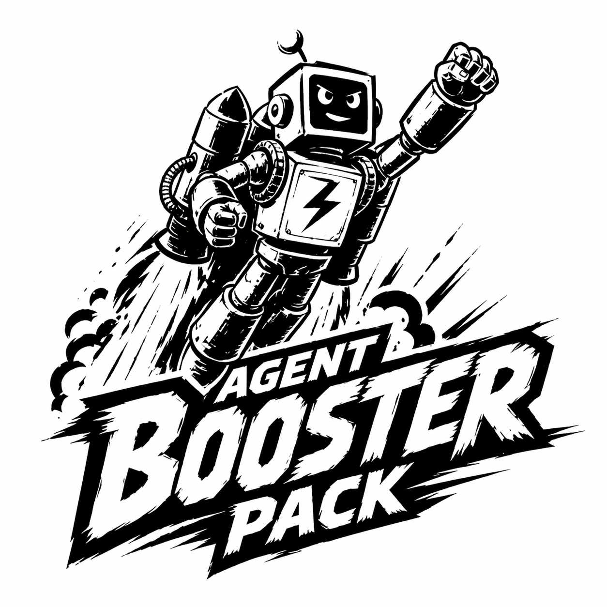

<p align="center">
  
</p>

# Agent Booster Pack

A portable set of high-leverage skills for leveling up coding agents.

This is my brain dump of 25+ years of software development: the habits,
standards, and hard-won lessons I have accumulated while working in startup
environments through giant private and public sector organizations. It reflects
the full gamut: doing everything at a startup, API in the morning and Android
SDK in the afternoon, through API governance and leading an SRE team that guided
hundreds of teams toward better engineering practices.

This is my source of truth for how coding agents should reason, change code,
prove correctness, and package work across Codex, Claude Code, and other agents
that understand the Agent Skills layout. Since skills were introduced, I have
documented and categorized each recurring correction I made to a model, turning
those interventions into guidance for how agents should approach the next
similar task. I also audited the skills libraries I could find and did not find
many that focused on increasing the engineering maturity or code quality of what
agents produced, so I made my own.

Complexity is death for any software project. Rich Hickey's _Simple Made Easy_
is the best talk I have ever heard on software engineering, and it is the
baseline for this set of skills. From experience, agents produce their best
results when they are pushed toward simplicity and required to prove their work
rather than merely claim completion. In practice, that means:

- Model values, states, invariants, and effects before picking abstractions.
- Turn every meaningful engineering claim into evidence.
- Prove behavior through the boundary a real caller uses.
- Let security, data loss, deploy risk, and production reliability outrank style
  and local habit.
- Keep changes small: one root cause, one logical behavior, one clean commit.

## Repository Shape

- `agents/AGENTS.md` is the global instruction file and skill index.
- `agents/.agents/skills/` contains portable skills for engineering judgment,
  proof obligations, testing, safety, production quality, UX, and workflow.
- `agents/.agents/commands/` contains cross-agent command prompts where a tool
  still supports command fan-out.
- `agents/.claude/CLAUDE.md` is a thin Claude Code wrapper around `AGENTS.md`.
- `setup.sh` wires skills and commands into tool-specific locations.

## Install

Prerequisites:

- Git.
- GNU Stow. `setup.sh` does not install Stow; it assumes `stow agents` has
  already created the shared links.

Install Stow if needed:

```sh
# macOS
brew install stow

# Debian / Ubuntu
sudo apt install stow

# Fedora
sudo dnf install stow
```

Fresh checkout and install:

```sh
git clone https://github.com/kreek/agent-booster-pack.git
cd agent-booster-pack
stow agents
./setup.sh
```

`stow agents` is the main install step. It links the repo's `agents/` package
into your home directory:

- `~/AGENTS.md`
- `~/.agents/skills/`
- `~/.agents/commands/`
- `~/.claude/CLAUDE.md`

`./setup.sh` is the compatibility step. It does not install Stow, clone the
repo, or merge instruction files. It adds tool-specific symlinks for agents that
do not rely only on `~/.agents/skills/`:

- `~/.claude/skills/` points at `~/.agents/skills/`
- `~/.codex/skills/<name>/` links each portable skill individually
- `~/.codeium/windsurf/skills/<name>/` links each skill when Windsurf is present
- `~/.claude/commands/<name>.md` links command prompts
- `~/.codex/prompts/<name>.md` is kept for legacy Codex prompt-command support

`stow agents` does not merge files. If `~/AGENTS.md` already exists as a real
file, Stow will report a conflict instead of appending the Agent Booster Pack
instructions. Do not use `stow --adopt` unless you intentionally want Stow to
take ownership of that file.

For an existing personal `~/AGENTS.md`, merge deliberately:

1. Keep any personal or workplace-specific rules that are still current.
2. Add the skill index and priority rules from `agents/AGENTS.md`.
3. Preserve the ABP rule that local project `AGENTS.md` files are additive and
   more specific, but must not weaken safety, proof, validation, or
   user-change-preservation requirements.
4. Run `stow --ignore='^AGENTS\.md$' agents` so `~/.agents/skills/`,
   `~/.agents/commands/`, and `~/.claude/CLAUDE.md` are still linked while your
   existing `~/AGENTS.md` remains manually maintained.
5. Run `./setup.sh` so tool-specific compatibility links are created from those
   shared `~/.agents` links.

Codex now discovers skills directly from `.agents/skills` / `~/.agents/skills`;
do not rely on `~/.codex/prompts` for slash commands in current Codex CLI.

GitHub Copilot CLI, Pi, Cursor, Gemini CLI, and OpenCode auto-discover from
`~/.agents/skills/`, so the `stow agents` link is enough — no extra `setup.sh`
wiring needed. Copilot also scans `~/.copilot/skills` and `~/.claude/skills`;
the pack deliberately leaves `~/.copilot/skills` unlinked so skills are not
registered twice. For project-scoped Copilot skills, drop a `.github/skills/`,
`.claude/skills/`, or `.agents/skills/` directory in the repo itself.

## Skill System

Skills are progressive context. Agents see only `name` and `description` until a
skill triggers, then load the matching `SKILL.md`, and only read references or
run scripts when the skill asks for them.

Each skill is opened only when the task calls for it; the right draw gives the
agent a sharper rule, workflow, and proof check for the work in front of it.

The skill pack is deliberately not a checklist library. It is a set of
discipline-enforcing lenses:

| Area                      | Skills                                                             |
| ------------------------- | ------------------------------------------------------------------ |
| Foundational design       | `data`, `proof`                                                    |
| Correctness and change    | `tests`, `debugging`, `refactoring`, `errors`                      |
| Safety gates              | `security`, `database`, `deployment`, `resilience`                 |
| Production quality        | `observability`, `realtime`, `concurrency`, `performance`, `cache` |
| Public/user surfaces      | `api`, `docs`, `frontend`, `accessibility`                         |
| Project and repo workflow | `scaffolding`, `git`, `commit`                                     |

The most important addition is `proof`: if an agent asserts a behavior,
invariant, contract, root cause, or refactor-safety claim, it must name the
proof obligation and evidence. Missing evidence is reported as unproven, not
complete.

The `scaffolding` skill includes ecosystem references for broad coverage and
makes some intentionally opinionated framework calls, such as Hono, SvelteKit,
FastAPI, Fiber, and Axum as defaults in their lanes. Node / TypeScript, Python,
Ruby, JVM, Rust, and frontend defaults reflect stronger day-to-day preferences.
PHP, Elixir, .NET, Go, and Swift references are included for agent coverage
rather than daily personal practice; verify those choices against current
official/community guidance before serious project work.

## Authoring Rules

Every skill should be short, directive, portable, and hard to skip:

- Use portable frontmatter: `name` plus a trigger-focused `description`.
- Put discriminating trigger words in the description; the body loads only after
  the skill triggers.
- State one Iron Law near the top when the skill has a non-negotiable rule.
- Include `When to Use` and `When NOT to Use` so neighboring skills do not blur
  together.
- Use imperative workflow steps; do not write background essays.
- Require evidence in `Verification`; unchecked proof obligations mean the work
  is reported as unproven.
- Use `Handoffs` to route to neighboring skills instead of duplicating their
  bodies.
- Put deterministic or fragile checks in `scripts/` so agents run them instead
  of re-deriving them.
- Put deeper reference material in `references/`; keep each referenced file one
  hop from `SKILL.md`.
- Delete stale or duplicative prose instead of preserving it as "context."

## Maintenance

After adding or renaming a skill:

```sh
./setup.sh
```

Then update:

- `agents/AGENTS.md` so agents can route to it
- this README so humans understand the pack
- any neighboring skills' handoffs when routing changes

Run the markdown check before publishing broad doc updates:

```sh
pnpm format:check
```

Use `pnpm format` only when you intend to rewrite all markdown formatting in the
repo.

## Remove

```sh
stow -D agents
```

Manual cleanup may still be needed for tool-specific symlinks under
`~/.claude/skills/`, `~/.codex/skills/`, `~/.codeium/windsurf/skills/`,
`~/.claude/commands/`, and `~/.codex/prompts/`.
